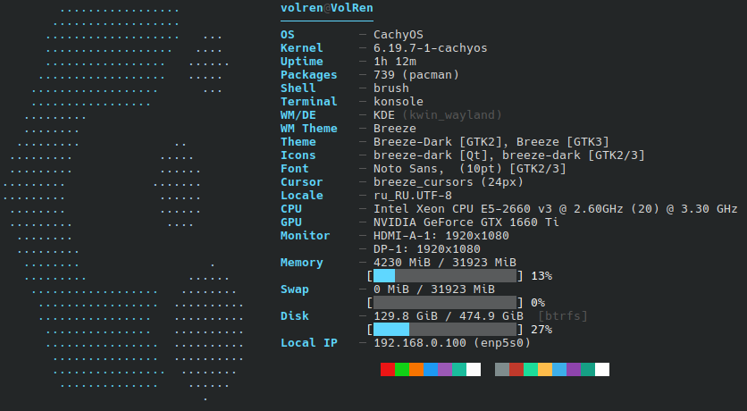

# cachyfetch

A fast and minimal system info fetcher written in [Zig](https://ziglang.org), built specifically for **CachyOS**.



## Features

- OS, Kernel, Uptime, Packages
- Shell, Terminal emulator
- DE, WM, WM Theme, Theme (Qt + GTK2/3), Icons, Font, Cursor
- Locale, Local IP
- CPU with frequency
- GPU (NVIDIA via `nvidia-smi`, AMD/Intel via `lspci`)
- Monitor resolution and refresh rate (Hyprland, X11, DRM fallback)
- Memory, Swap, Disk with progress bars and filesystem type
- 16-color palette

## Installation

### Manual

```bash
git clone https://github.com/VolRencs/cachyfetch
cd cachyfetch
zig build -Doptimize=ReleaseFast -Dtarget=x86_64-linux -Dcpu=baseline
sudo install -Dm755 zig-out/bin/cachyfetch /usr/bin/cachyfetch
```

## Requirements

**Build:**
- `zig` ≥ 0.15.0

**Runtime (all optional):**
- `pciutils` — GPU name detection via `lspci`
- `nvidia-utils` — NVIDIA GPU name via `nvidia-smi`
- `xorg-xrandr` — monitor detection on X11

## Project structure

```
cachyfetch/
├── src/
│   ├── main.zig    # rendering, output
│   └── fetch.zig   # system info collection
├── build.zig
├── build.zig.zon
└── PKGBUILD
```

## License

MIT
